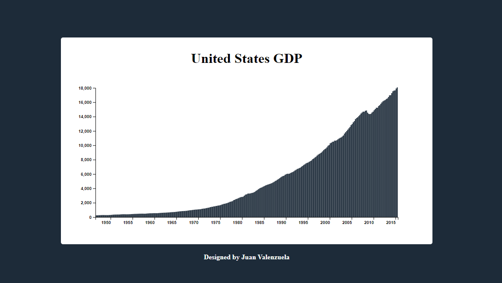

# GRÁFICO DE BARRAS DEL PIB DE ESTADOS UNIDOS

Este proyecto es una visualización interactiva del Producto Interno Bruto (GDP) de los Estados Unidos, creada utilizando la biblioteca D3.js. La gráfica de barras muestra el crecimiento económico del país desde mediados del siglo XX hasta la fecha actual, permitiendo a los usuarios explorar los datos históricos de una manera clara y visualmente atractiva.

## Características

- Visualización Dinámica: Se genera un gráfico de barras que representa el GDP de Estados Unidos en diferentes años, utilizando datos obtenidos de una API pública.
- Interactividad: Al pasar el cursor sobre cada barra, se muestra un tooltip con detalles adicionales, incluyendo el año y el valor del GDP correspondiente.
- Uso de una API Pública: Los datos del GDP se obtienen dinámicamente desde una API pública proporcionada por FreeCodeCamp, garantizando la precisión y actualidad de la información.
- Datos Precisos: Los datos utilizados provienen de una fuente confiable y se actualizan automáticamente al cargar la visualización.

## Tecnologías Utilizadas

- HTML5 | CSS3: Utilizado para la estructura, el estilo y la animación de la aplicación.
- JavaScript ES6.
- D3: Para manejo y renderizado de gráficos
- API's

## Autor

- Juan Valenzuela
- https://github.com/Juan-Valenzuela3
- https://www.linkedin.com/in/juan-valenzuela-camelo

## Licencia

- Este proyecto está licenciado bajo la [Licencia MIT](./LICENSE).

